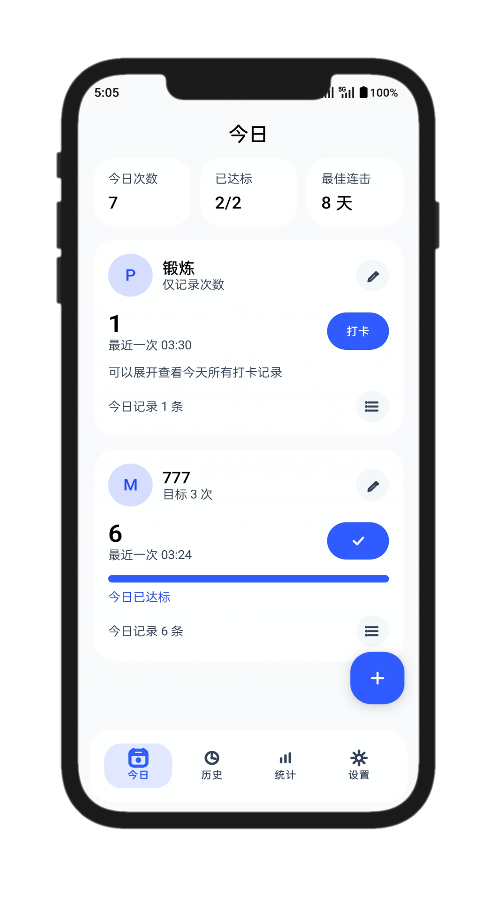
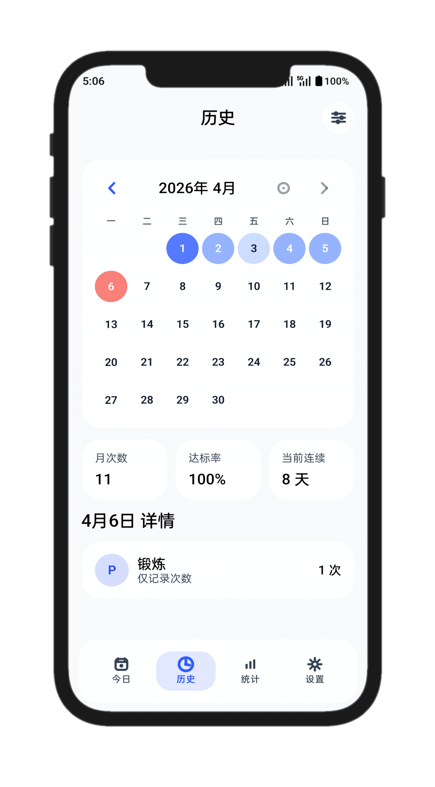
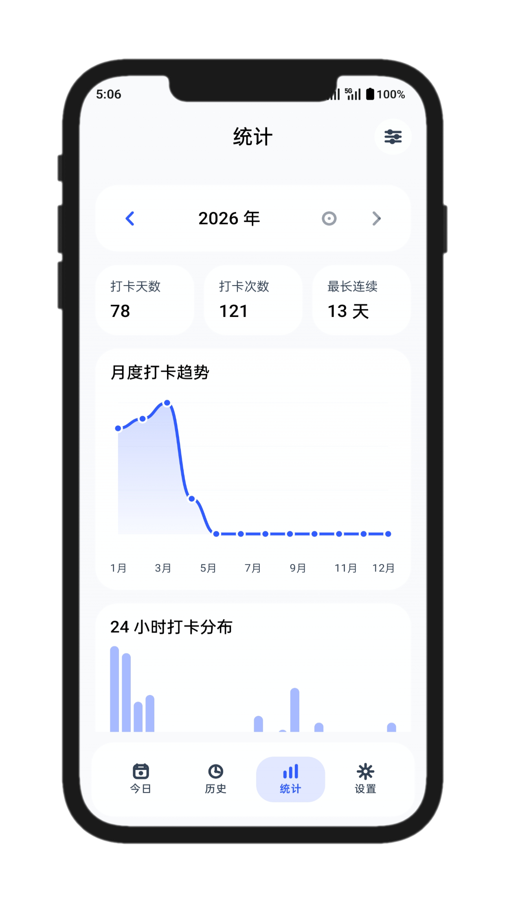
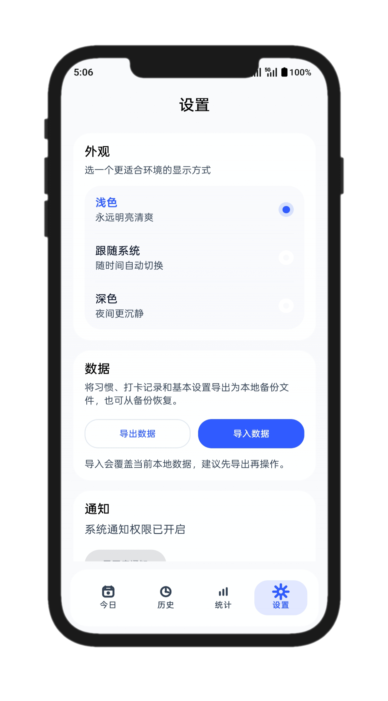

# 刻度

刻度是一款完全本地运行的 Android 次数型习惯打卡应用，专注于“多次打卡、趋势查看、离线可用”这三件事。应用基于 `Kotlin + Jetpack Compose` 构建，不依赖云端服务，不需要账号登录，所有数据默认保存在本机。

项目当前已完成 `v1.0.0` 正式版配置，支持签名 APK / AAB 构建、数据导入导出、本地提醒、月度历史查看和年度统计分析。

## &#x5E94;&#x7528;&#x622A;&#x56FE;

<div align="center">
  <table>
    <tr>
      <td align="center"><strong>&#x4ECA;&#x65E5;</strong></td>
      <td align="center"><strong>&#x5386;&#x53F2;</strong></td>
    </tr>
    <tr>
      <td></td>
      <td></td>
    </tr>
    <tr>
      <td align="center"><strong>&#x7EDF;&#x8BA1;</strong></td>
      <td align="center"><strong>&#x8BBE;&#x7F6E;</strong></td>
    </tr>
    <tr>
      <td></td>
      <td></td>
    </tr>
  </table>
</div>

&#x8BF4;&#x660E;&#xFF1A;
&#x5F53;&#x524D; README &#x5DF2;&#x76F4;&#x63A5;&#x5F15;&#x7528; `docs/images/` &#x4E0B;&#x7684; JPG &#x622A;&#x56FE;&#x6587;&#x4EF6;&#xFF0C;&#x5982;&#x9700;&#x66FF;&#x6362;&#xFF0C;&#x53EA;&#x8981;&#x4FDD;&#x6301;&#x540C;&#x540D;&#x6587;&#x4EF6;&#x5373;&#x53EF;&#x3002;


## 项目特点

- 完全本地离线运行，无账号、无后端、无云同步
- 支持多个习惯、同一习惯一天内多次打卡
- 支持可选每日目标，无目标习惯也可参与连续统计
- 今日页支持快速打卡、展开查看当日记录、删除单条记录
- 历史页支持按习惯筛选、月历热力展示、当天记录明细
- 统计页支持年度趋势、年度次数、最长连续、24 小时分布、月度详细数据
- 设置页支持主题切换、通知权限、本地 JSON 导入导出
- 支持本地提醒，应用重启后会自动恢复提醒调度

## 功能概览

### 1. 今日

- 展示今日总打卡次数、已达标习惯数、最佳连续表现
- 每个习惯卡片支持一键打卡
- 有目标的习惯：
  - 未完成时按钮显示“打卡”
  - 达标后按钮显示勾选状态
- 无目标的习惯：
  - 只要当天至少打卡一次，就视为当天达标
- 支持展开查看今天的每一条打卡记录
- 支持长按习惯卡片后确认删除习惯
- 支持长按单条打卡记录后确认删除

### 2. 历史

- 支持按单个习惯筛选查看
- 支持月份切换、回到本月、左右滑动切换月份
- 月历使用颜色深浅表示当天打卡量
- 选中日期后，可查看该习惯当天的打卡详情
- 详情以底部弹窗形式展示，支持长按删除单条记录
- 连续与达标规则：
  - 有目标习惯：当日打卡次数大于等于目标次数，视为达标
  - 无目标习惯：当日只要有 1 次打卡，视为达标

### 3. 统计

- 按年查看单个习惯的年度统计
- 顶部支持按习惯筛选
- 支持上一年 / 下一年 / 回到今年
- 提供以下统计内容：
  - 年度打卡天数
  - 年度打卡次数
  - 最长连续天数
  - 月度打卡趋势图
  - 24 小时打卡分布图
  - 月度详细数据（打卡天数 / 次数 / 最长连续）
- 趋势图和小时分布图支持按住后左右滑动预览数据

### 4. 设置

- 支持浅色 / 深色 / 跟随系统主题
- 支持请求通知权限
- 支持导出本地数据为 JSON
- 支持从 JSON 备份导入数据

## 设计方向

- 风格：简洁、轻盈、偏 iOS 观感
- 视觉：大圆角、留白、浅背景、克制高亮
- 动效：页面切换、统计图表、月历切换、数值变化都做了轻量动画
- 品牌：应用名称为“刻度”，图标采用 `K + 刻痕` 的方向

## 技术栈

- Kotlin
- Jetpack Compose
- Material 3
- Room
- DataStore
- WorkManager
- MVVM + Repository
- KSP

## 项目结构

```text
app/src/main/java/com/pulse/checkin
├── data
│   ├── backup            # 导入导出
│   ├── db                # Room 数据库、DAO、实体
│   ├── preferences       # DataStore 偏好设置
│   └── repository        # Repository 实现
├── domain
│   ├── model             # 核心模型
│   ├── repository        # Repository 接口
│   └── stats             # 今日 / 月度 / 年度统计计算
├── reminder              # 本地提醒与开机恢复
├── ui
│   ├── components        # 通用组件
│   ├── screen            # Today / History / Stats / Settings 页面
│   ├── theme             # 颜色、排版、主题
│   └── util              # UI 工具方法
├── MainActivity.kt
└── PulseApplication.kt   # AppContainer 与依赖装配
```

## 数据与业务规则

### 打卡数据模型

- 一个习惯可以在一天内记录多次打卡
- 每次打卡都会保存为独立事件
- 日次数、月次数、年度趋势都由事件聚合计算

### 达标规则

- 有目标习惯：当天打卡次数 `>= dailyTargetCount`，当天达标
- 无目标习惯：当天打卡次数 `>= 1`，当天达标

### 连续规则

- 连续口径统一为“连续达标天数”
- 无目标习惯也参与连续统计
- 当前连续会以当前页面锚点日期向前计算

## 本地存储

- 习惯数据：Room
- 打卡事件：Room
- 用户设置：DataStore
- 备份格式：JSON

导出 JSON 当前包含：

- 应用备份版本号
- 导出时间
- 用户偏好设置
- 习惯列表
- 打卡事件列表

## 开发环境

- Android Studio（建议使用较新稳定版）
- JDK 17
- Android SDK 35
- Gradle Wrapper（项目已自带）

## 快速开始

### 1. 克隆项目

```bash
git clone <your-repo-url>
cd project
```

### 2. 用 Android Studio 打开

- 直接打开项目根目录 `F:\Android\project`
- 等待 Gradle 同步完成

### 3. 运行 Debug 版本

```bash
./gradlew :app:assembleDebug
```

Windows PowerShell：

```powershell
& '.\gradlew.bat' :app:assembleDebug --offline
```

生成的 APK 路径：

```text
app/build/outputs/apk/debug/app-debug.apk
```

## 常用命令

### Debug 构建

```powershell
& '.\gradlew.bat' :app:assembleDebug --offline
```

### Release APK 构建

```powershell
& '.\gradlew.bat' :app:assembleRelease --offline
```

### Release AAB 构建

```powershell
& '.\gradlew.bat' :app:bundleRelease --offline
```

### 单元测试

```powershell
& '.\gradlew.bat' :app:testDebugUnitTest
```

## 正式版打包

项目已经支持 `v1.0.0` 正式版打包。

### 当前版本

- `versionCode = 1`
- `versionName = "1.0.0"`

### Release 配置

- 开启 `minifyEnabled`
- 开启 `shrinkResources`
- 配置了 release signing 读取逻辑
- release lint 已改为不阻塞离线出包

### 签名文件

项目当前使用本地签名配置文件：

```text
release-signing.properties
```

示例模板：

```text
release-signing.properties.example
```

配置内容如下：

```properties
storeFile=keystore/kedu-release-v2.jks
storePassword=your_store_password
keyAlias=kedu-release
keyPassword=your_key_password
```

### 已生成产物

签名 APK：

```text
app/build/outputs/apk/release/app-release.apk
```

上架 AAB：

```text
app/build/outputs/bundle/release/app-release.aab
```

## 导入导出说明

### 导出

- 在设置页点击“导出数据”
- 通过系统文件选择器保存为 JSON

### 导入

- 在设置页点击“导入数据”
- 选择此前导出的 JSON 文件
- 导入会覆盖当前本地数据

### 第三方数据改造

仓库中保留了示例文件：

- [data.json](./data.json)
- [data_pulse_import.json](./data_pulse_import.json)

其中 `data_pulse_import.json` 是已转换为当前应用可导入格式的样例。

## 提醒机制

- 每个习惯支持一个每日提醒时间
- 提醒通过 WorkManager 调度
- 安装更新、重启设备后会尝试恢复提醒

## 测试覆盖

当前单元测试重点覆盖：

- 多次打卡聚合
- 当日达标判定
- 无目标习惯连续逻辑
- 月度与年度统计计算
- 小时分布与趋势数据聚合

运行命令：

```powershell
& '.\gradlew.bat' :app:testDebugUnitTest
```

## 已知说明

- 应用为单模块结构，适合当前阶段快速迭代
- 当前以手机竖屏为主要目标场景
- release 构建默认支持本地签名；如需更换正式证书，只需要替换 keystore 与 `release-signing.properties`
- 仓库中的 keystore 和签名配置仅供当前本地构建使用，正式发布前建议自行更换为独立保管的证书

## 后续可扩展方向

- 国际化语言支持
- 更细的习惯分类与排序能力
- 更丰富的年度对比分析
- Widget / 快捷操作支持
- 平板与横屏布局适配

## 许可证

当前仓库未单独声明开源许可证。如需开源发布，建议补充 `LICENSE` 文件。

## 最近更新

- 新增中英文界面切换，并支持在设置页内无闪动切换
- 习惯创建与编辑支持图标库选择，使用 `Designhabiticons-main` 中的习惯图标资源
- 底部导航栏和主要操作图标已统一为应用内图标库，并优化为玻璃 / 液体玻璃质感
- 今日页习惯卡片支持打卡二次确认、删除确认、距离上次打卡相对时间显示
- 历史页、统计页和设置页的筛选、切换时间、导入导出等图标已全部统一风格
- 设置页已精简提示文案，支持主题切换、通知权限、数据导入导出及版本号显示
- 新建习惯弹窗背景增加模糊与遮罩过渡动画，主题切换也支持更柔和的颜色过渡

