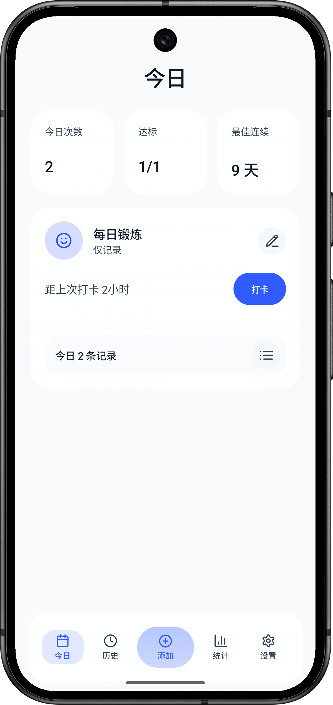
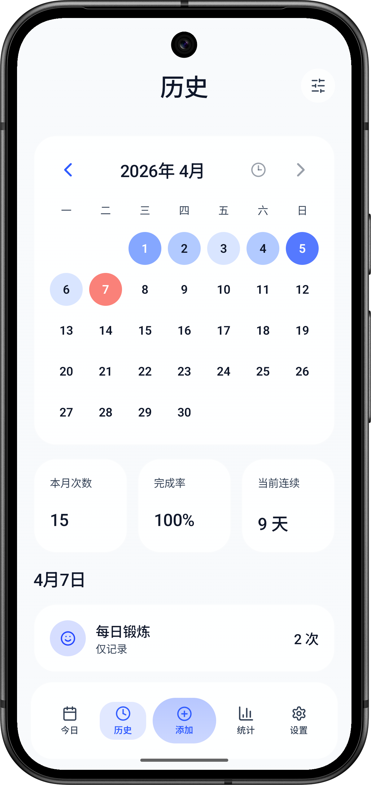
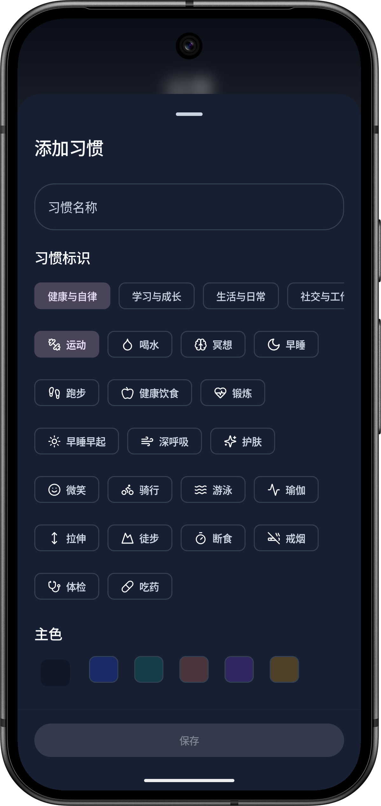
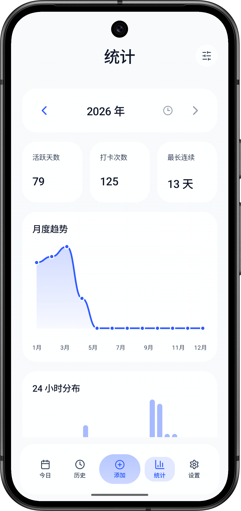
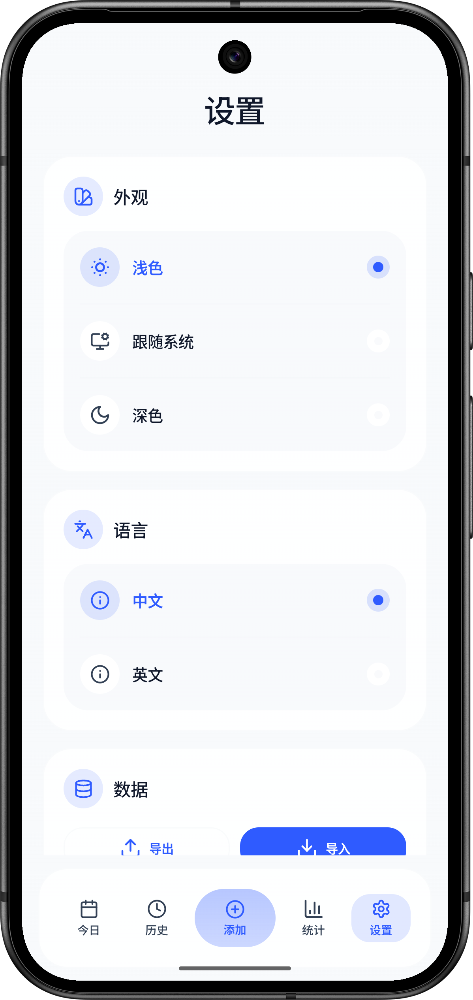
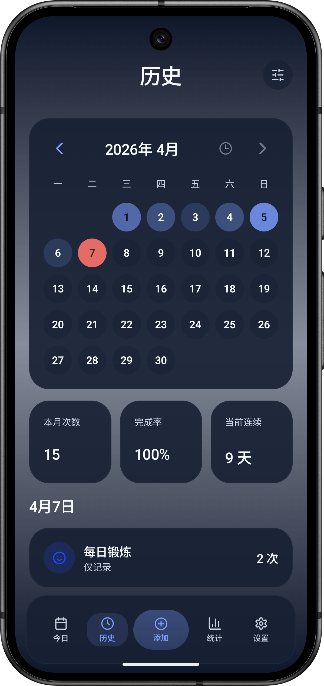

# 刻度（Pulse）

刻度是一款本地优先的 Android 习惯打卡应用，面向“可多次打卡、可回看趋势、可离线使用”的日常记录场景。项目基于 Kotlin 与 Jetpack Compose 开发，数据默认保存在本机，登录账号后可通过云端在多个设备间同步习惯与打卡记录。

当前仓库对应版本为 `v1.2.0`，已经支持正式包签名构建、历史补卡、本地通知提醒、数据导入导出、账号登录与多设备云同步、重要日期（纪念日/倒计时）、中英文切换，以及今日 / 历史 / 统计 / 设置四个主要页面。

## 应用截图

<div align="center">
  <table>
    <tr>
      <td align="center"><strong>今日</strong></td>
      <td align="center"><strong>历史</strong></td>
      <td align="center"><strong>新增 / 编辑习惯</strong></td>
    </tr>
    <tr>
      <td></td>
      <td></td>
      <td></td>
    </tr>
    <tr>
      <td align="center"><strong>统计</strong></td>
      <td align="center"><strong>设置</strong></td>
      <td align="center"><strong>深色模式</strong></td>
    </tr>
    <tr>
      <td></td>
      <td></td>
      <td></td>
    </tr>
  </table>
</div>

## 当前功能

### 今日页

- 展示今日总打卡次数、达标习惯数、最佳连续等概览数据
- 右上角按钮新建习惯；支持习惯一键打卡，并保留当日多次打卡记录
- 支持查看每个习惯当天的记录列表与相对时间
- 打卡可填写备注，点击记录查看详情（时间、补卡标记、备注）
- 支持删除单条打卡记录
- 支持新增、编辑、删除习惯

### 历史页

- 支持按习惯筛选查看月历与当日详情
- 支持左右滑动或按钮切换月份
- 月历使用颜色深浅展示当月打卡密度
- 当天日期会显示为“今”或对应英文短文案
- 存在补卡记录的日期会显示底部标记
- 支持在历史记录弹层中为过去日期补卡
- 补卡记录会在列表中单独标记，并参与正常统计
- 有备注的记录在列表中显示标识，点击记录查看详情
- 右上角分享按钮可生成当月统计图片并保存 / 分享

### 统计页

- 以年份为维度查看单个习惯的年度统计
- 顶部汇总卡展示完成率、活跃天数、打卡次数、最长连续
- 支持月度趋势图与 24 小时分布图预览
- 月度明细支持查看每月完成率、活跃天数、打卡次数、最长连续
- 支持左右切换年份和回到当年
- 右上角分享按钮可生成年度统计卡片图并保存 / 分享

### 设置页

- 支持邮箱账号注册 / 登录 / 登出，登录后习惯与打卡记录跨设备同步
- 支持手动触发同步并显示上次同步时间
- 退出登录有二次确认，登录 / 注册时有等待动画
- 支持浅色 / 深色 / 跟随系统主题
- 支持中文 / 英文界面切换
- 支持本地 JSON 导出与导入
- 支持通知权限状态查看与本地提醒开关
- 显示当前应用版本信息

### 重要日期页

- 底部导航「日期」页签进入「重要日期」页面
- 记录任意事件日期：未来显示「还有 N 天」，过去显示「已过去 N 天」，当天显示「今天」
- 未来日期显示剩余进度条，循环日期不显示年份
- 支持每年重复（纪念日每年循环计算下一次，含 2/29 闰年处理）与可选备注
- 循环日期支持阳历/农历（农历按当年换算，支持闰月；适合农历生日等场景）
- 列表支持长按拖动排序，点击编辑；删除操作在编辑弹层中
- 重要日期随账号云端同步

## 业务规则

### 打卡与补卡

- 一个习惯可以在同一天记录多次打卡
- 每次打卡都会保存为独立事件
- 补卡只允许针对过去日期执行
- 补卡写入当前操作时间，但归属到选中的历史日期
- 补卡记录与普通打卡使用同一套统计口径，只额外保留“补卡”标记

### 达标规则

- 有目标习惯：当天打卡次数 `>= dailyTargetCount` 视为达标
- 无目标习惯：当天至少有 1 次记录即视为达标

### 连续规则

- 连续口径统一为“连续达标天数”
- 无目标习惯也参与连续统计
- 历史页与统计页都基于聚合后的按日数据计算连续结果

### 完成率规则

- 历史页月度完成率：当月达标总数 / 当月应统计总数
- 统计页年度完成率：
  - 无目标习惯：有记录天数 / 当年总天数
  - 有目标习惯：达标天数 / 当年总天数
- 统计页月度明细完成率：
  - 无目标习惯：当月有记录天数 / 当月总天数
  - 有目标习惯：当月达标天数 / 当月总天数

## 技术栈

- Kotlin
- Jetpack Compose
- Material 3
- Room
- DataStore Preferences
- WorkManager
- KSP
- Retrofit + OkHttp + kotlinx-serialization
- MVVM + Repository

云端同步后端基于 Cloudflare Workers + D1（SQLite），采用单条记录 Last-Write-Wins 合并策略；打卡删除以软删除墓碑同步，保证删除能跨设备传播。后端源码位于仓库 `cloud/` 目录。

## 项目结构

```text
app/src/main/java/com/pulse/checkin
├── data
│   ├── backup
│   │   └── BackupManager.kt        # JSON 导入导出与备份摘要
│   ├── cloud
│   │   ├── CloudApi.kt             # 云端 REST 接口（Retrofit）
│   │   ├── SessionManager.kt       # 会话、同步水位、时钟偏移存储
│   │   ├── SyncManager.kt          # 登录注册与同步引擎
│   │   └── SyncWorker.kt           # WorkManager 周期同步
│   ├── db
│   │   ├── dao/                    # Room DAO
│   │   ├── entity/                 # Room Entity
│   │   └── PulseDatabase.kt        # 数据库定义与迁移
│   ├── preferences
│   │   └── AppPreferences.kt       # 主题、语言、提醒等偏好存储
│   └── repository
│       └── Repositories.kt         # 仓储接口实现与数据映射
├── domain
│   ├── model
│   │   └── Models.kt               # Habit / CheckInEvent / 设置模型
│   ├── repository
│   │   └── Repositories.kt         # 领域层仓储接口
│   └── stats
│       ├── StatsCalculator.kt      # 今日、历史、统计页聚合口径
│       └── DayCountCalculator.kt   # 重要日期天数与农历换算
├── reminder
│   ├── Reminder.kt                 # Worker、通知、开机恢复实现
│   └── ReminderScheduler.kt        # 提醒调度接口
├── ui
│   ├── components/                # 通用 Compose 组件与弹层
│   ├── i18n/
│   │   └── PulseStrings.kt        # 中英文文案封装
│   ├── screen
│   │   ├── TodayScreen.kt         # 今日页
│   │   ├── HistoryScreen.kt       # 历史页与月历
│   │   ├── StatsScreen.kt         # 统计页
│   │   ├── SettingsScreen.kt      # 设置页
│   │   └── DayEventsScreen.kt     # 重要日期页
│   ├── theme
│   │   ├── Theme.kt               # 主题入口
│   │   ├── Colors.kt              # 色板
│   │   └── Type.kt                # 排版
│   ├── util/                      # 颜色、时间、预览等 UI 工具
│   ├── AppViewModel.kt            # 页面状态聚合与业务入口
│   └── PulseApp.kt                # Scaffold、导航与弹层协调
├── MainActivity.kt                # Activity 入口
└── PulseApplication.kt            # AppContainer 与依赖装配
```

### 结构说明

- `data/`：负责“怎么存”和“怎么读”，包含 Room、DataStore、备份导入导出，以及仓储实现。
- `domain/model/`：放跨页面共享的核心业务模型，比如习惯、打卡事件、主题与语言设置。
- `domain/stats/`：是统计口径的核心位置，今日页概览、历史页月历、统计页年度汇总都在这里聚合。
- `reminder/`：负责本地通知提醒、WorkManager 调度，以及开机或应用更新后的提醒恢复。
- `ui/screen/`：按页面拆分，主要改动通常会落在这里。
- `ui/components/`：放通用卡片、按钮、图标、弹窗、编辑器等可复用 Compose 组件。
- `ui/i18n/`：统一管理界面文案，涉及中英文适配时优先改这里。
- `ui/theme/`：统一管理颜色、排版、主题切换与动态过渡。
- `ui/AppViewModel.kt`：连接仓储、统计计算与页面状态，是大多数用户操作的统一入口。
- `ui/PulseApp.kt`：负责主应用壳层、底部导航、页面切换和弹层挂载。

## 本地存储与权限

### 本地存储

- 习惯数据：Room
- 打卡事件：Room
- 用户偏好：DataStore
- 登录会话与同步状态：DataStore
- 备份格式：JSON

导出的 JSON（v2）当前包含：

- 备份版本号
- 导出时间
- 用户偏好设置
- 习惯列表
- 打卡事件列表
- 重要日期列表

仍可导入 v1 格式备份，旧版 Long 主键会映射为全局唯一 ID。

### 权限与提醒

应用当前声明了以下权限：

- `POST_NOTIFICATIONS`
- `RECEIVE_BOOT_COMPLETED`
- `VIBRATE`
- `INTERNET`
- `ACCESS_NETWORK_STATE`

提醒通过 `WorkManager` 按天调度，本质上是本地系统通知，不要求应用保持前台。设备重启或应用更新后，会尝试重新同步提醒任务。

## 云端部署

同步后端部署在 Cloudflare Workers + D1，配置与源码见 `cloud/`：

1. `cd cloud && npm install`
2. `npx wrangler login`
3. `npx wrangler d1 create pulse`，把返回的 `database_id` 填入 `cloud/wrangler.toml`
4. `npm run migrate:remote` 创建数据表
5. `npm run deploy` 部署

部署后把 API 地址写入 Android 工程根目录 `local.properties`：

```properties
PULSE_API_BASE_URL=https://sync.kon123.click
```

自定义域名在 `cloud/wrangler.toml` 的 `routes` 中配置（`custom_domain = true`），需要先把域名接入 Cloudflare 并开通 Worker 自定义域名。未配置该地址时，应用仍可完全离线使用，仅账号与同步功能不可用。

## 开发环境

- Android Studio 最新稳定版或近几个稳定版本
- JDK 17
- Android SDK 35
- Gradle Wrapper（仓库已包含）

## 快速开始

### 1. 克隆项目

```bash
git clone <your-repo-url>
cd project
```

### 2. 使用 Android Studio 打开

直接打开项目根目录：

```text
F:\Android\project
```

等待 Gradle 同步完成后即可运行或调试。

### 3. 本地调试构建

Windows PowerShell：

```powershell
& '.\gradlew.bat' :app:assembleDebug --offline
```

生成的调试包路径：

```text
app/build/outputs/apk/debug/app-debug.apk
```

## 常用命令

### Debug 构建

```powershell
& '.\gradlew.bat' :app:assembleDebug --offline
```

### Release APK 构建

```powershell
& '.\gradlew.bat' :app:assembleRelease --offline
```

### Release AAB 构建

```powershell
& '.\gradlew.bat' :app:bundleRelease --offline
```

### 单元测试

```powershell
& '.\gradlew.bat' :app:testDebugUnitTest
```

## Release 打包说明

### 当前版本

- `versionCode = 7`
- `versionName = "1.2.0"`

### 构建配置

- `minSdk = 29`
- `targetSdk = 35`
- `compileSdk = 35`
- Release 构建开启代码压缩与资源收缩
- 当存在有效的签名配置时，Release 会自动使用对应签名

### 签名配置文件

项目读取根目录下的：

```text
release-signing.properties
```

示例模板：

```text
release-signing.properties.example
```

示例内容：

```properties
storeFile=keystore/kedu-release.jks
storePassword=your_store_password
keyAlias=your_key_alias
keyPassword=your_key_password
```

### 构建产物路径

Release APK：

```text
app/build/outputs/apk/release/app-release.apk
```

Release AAB：

```text
app/build/outputs/bundle/release/app-release.aab
```

## 导入导出说明

### 导出

- 在设置页选择导出入口
- 通过系统文件选择器保存为 JSON

### 导入

- 在设置页选择导入入口
- 选择此前导出的 JSON 文件
- 导入会覆盖当前本地数据

## 测试覆盖

当前单元测试主要覆盖：

- 多次打卡聚合逻辑
- 达标与连续计算
- 历史月历与补卡标记
- 年度统计与完成率口径
- 小时分布与月度明细聚合
- 重要日期天数计算（未来 / 过去 / 今天、跨年循环、闰年 2/29、农历换算、剩余进度）
- 云同步推送 / 拉取 / 合并（习惯、打卡记录、重要日期）

运行命令：

```powershell
& '.\gradlew.bat' :app:testDebugUnitTest
```

## 当前已知情况

- 项目目前为单模块 Android 应用
- 主要以手机竖屏体验为主
- 通知由 WorkManager 周期任务驱动，提醒时间存在系统级延迟的可能
- 仓库中包含本地签名配置模板，正式发布前建议替换为自有签名信息

## 更新记录

### v1.2.0（当前）

- 新增「重要日期」页（纪念日 / 倒计时）：未来 / 过去天数、剩余进度条、长按拖动排序、应用风格日期选择器
- 循环日期支持阳历 / 农历（农历按当年换算，支持闰月，适合农历生日）
- 打卡支持备注与记录详情，列表显示备注标识
- 统计页与历史页支持生成分享图片（预览、保存相册、系统分享）
- 设置页退出登录二次确认、登录 / 注册等待动画
- 云同步后端绑定自定义域名 `sync.kon123.click`

### v1.1.0

- 新增邮箱账号登录与多设备云同步（Cloudflare Workers + D1）
- 数据主键改为 UUID，支持软删除与 Last-Write-Wins 冲突合并
- 备份格式升级 v2，仍兼容导入 v1

### v1.0.x

- 历史补卡、统计页年度分析、本地通知提醒、JSON 导入导出、中英文与主题切换

## License

当前仓库未单独声明开源许可证；如需公开发布，建议补充 `LICENSE` 文件。
